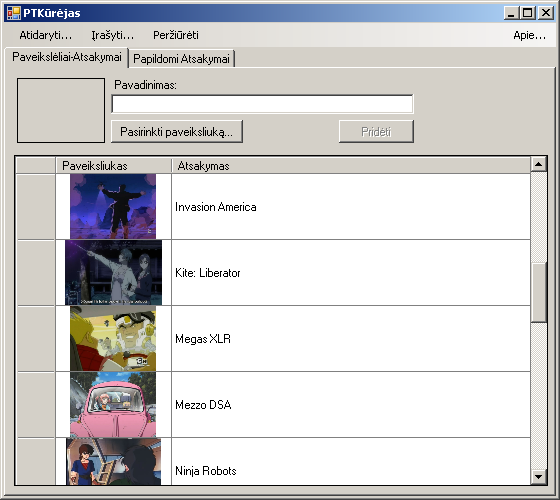
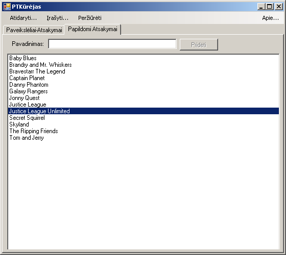
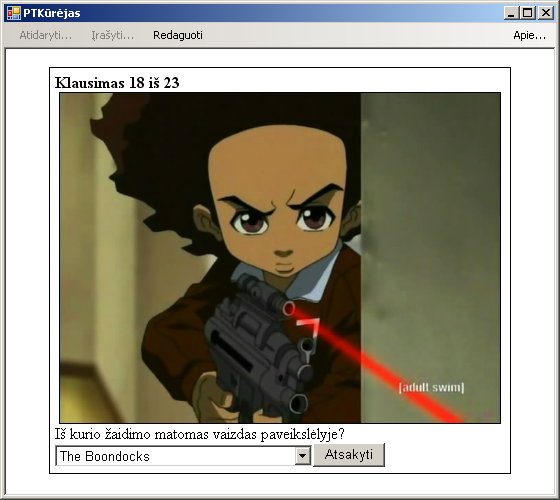

„Paveikslėlių-atsakymų“ skiltelėje yra paveikslėliai ir su jais surišti atsakymai: 

„Papildomų atsakymų“ skiltelėje yra sąrašas atsakymų, kurie bus rodomi testo sąraše nors nei vienas iš jų nebus susijęs su kokiu nors paveikslėliu: 

Taip atrodo pavyzdynio testo peržiūra/sprendimas: 
